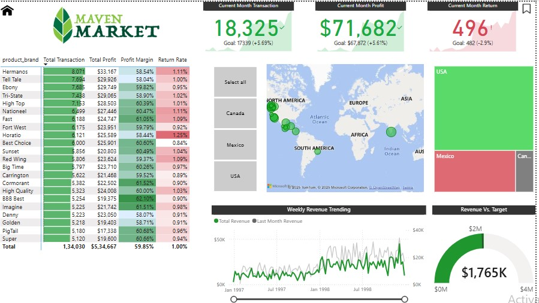

# Maven-Market-Sales-Analysis
"Sales and profit analysis of Maven Market through a dynamic Power BI dashboard. Discover insights from over 1 lakh transactions with interactive visualizations!"

An interactive Power BI dashboard analyzing sales trends, product performance, and customer data for Maven Market. This project leverages Power BI's capabilities, including DAX measures, interactive slicers, and various visualizations, to provide actionable business insights.

---

## ✨ Key Features

- **KPIs Displayed:**
  - **Total Transactions:** 18,325 (with goal tracking)
  - **Total Profit:** $71,682 (with goal tracking)
  - **Total Returns:** 496 (with goal tracking)

- **Visual Insights:**
  - **Product Performance:** Bar chart ranking products by total transactions, profit margin, and return rate.
  - **Geographic Analysis:** Map visual showing sales performance across different regions.
  - **Weekly Revenue Trends:** Line chart tracking total revenue trends over time.
  - **Revenue vs. Target:** Gauge visual comparing actual revenue against the set target.

- **Interactive Filters:**
  - Slicers for region, product brand, and transaction dates to filter and explore data dynamically.

---

## 🏠 Dataset Overview

The dataset used in this project includes multiple CSV files:

1. **MavenMarket_Calendar.csv:** Calendar data for date-based filtering and analysis.
2. **MavenMarket_Regions.csv:** Details about regions for geographic analysis.
3. **MavenMarket_Stores.csv:** Information on different Maven Market store locations.
4. **MavenMarket_Returns_1997-1998.csv:** Data on product returns.
5. **MavenMarket_Customers.csv:** Customer data for segmentation and demographic analysis.
6. **MavenMarket_Transactions_1997.csv:** Sales transactions for 1997.
7. **MavenMarket_Transactions_1998.csv:** Sales transactions for 1998.
8. **MavenMarket_Products.csv:** Product data including brands, categories, and SKUs.

---

## 📊 Dashboard Screenshot

---

## 🔧 How to Use the Dashboard

1. **Download the Power BI file or Excel dashboard from this repository.**
2. **Open the file in Power BI Desktop (for Power BI) or Excel (if applicable).**
3. **Explore Interactive Filters:** Adjust slicers and filters to analyze sales performance by product, region, and time period.
4. **Review Key Insights:** Analyze top-performing products, sales trends, and customer behavior.

---

## 🌐 Repository Contents

- **Power BI Dashboard File:** [https://github.com/thy-mechanic/Maven-Market-Sales-Analysis/raw/refs/heads/main/Maven_Market_Report.pbix]
- **`MavenMarket_Dataset_Files.zip`:** Contains all the CSV files used in this analysis.
- **Dashboard Screenshot:** Provides a visual overview of the dashboard.

---

## 📢 Project Summary

This project demonstrates my ability to work with large datasets, create dynamic dashboards, and extract meaningful insights from data. By analyzing sales performance, customer trends, and product profitability, the dashboard provides actionable recommendations to improve business outcomes.

---

## 👫 Connect with Me

Check out my other projects on GitHub or connect with me on [LinkedIn](https://www.linkedin.com).

---
